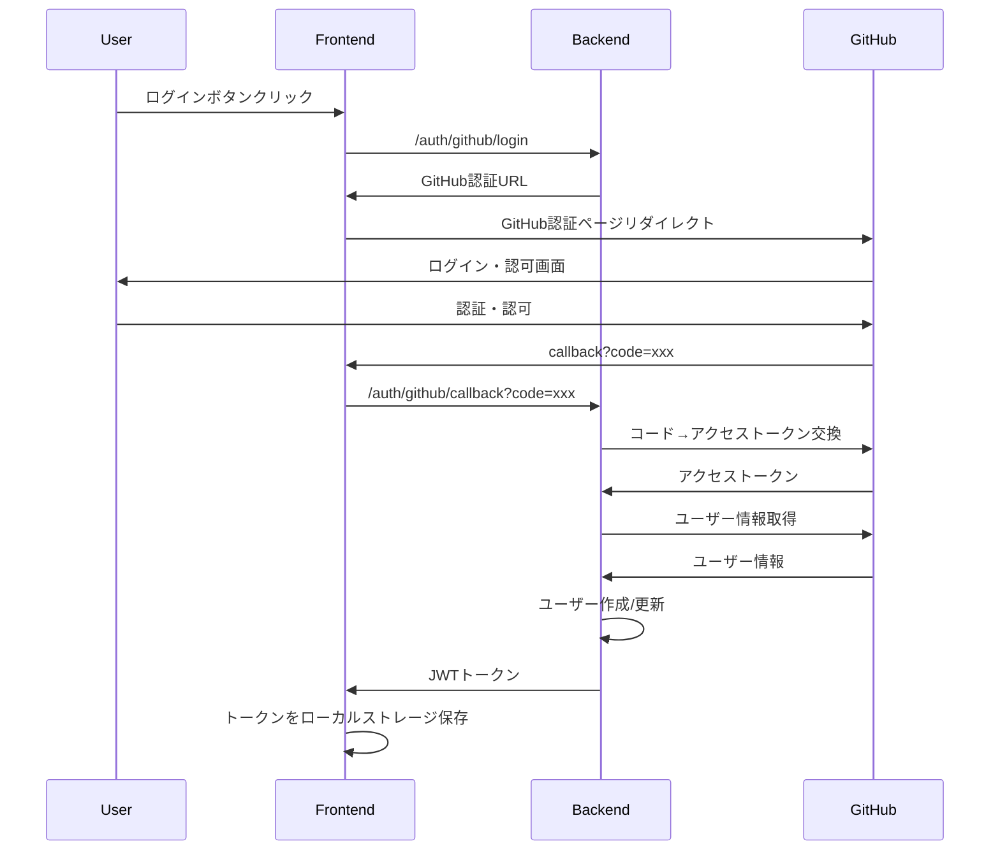

# GitHub OAuth認証仕様

## 概要

LunirアプリケーションにGitHub OAuthを使用したユーザー認証機能を実装する。

## 認証フロー

### 1. GitHub OAuth 2.0フロー



## API エンドポイント

### バックエンドAPI

| メソッド | エンドポイント | 説明 | レスポンス |
|---------|---------------|------|------------|
| GET | `/auth/github/login` | GitHub認証URL取得 | `{"auth_url": "https://github.com/oauth/authorize?..."}` |
| GET | `/auth/github/callback` | GitHub認証コールバック | `{"access_token": "jwt_token", "user": {...}}` |
| POST | `/auth/logout` | ログアウト | `{"message": "logged out"}` |
| GET | `/auth/me` | 現在のユーザー情報取得 | `{"user": {...}}` |

### フロントエンドルート

| ルート | 説明 | 認証要否 |
|-------|------|----------|
| `/login` | ログインページ | 不要 |
| `/callback` | GitHub認証コールバック処理 | 不要 |
| `/dashboard` | ダッシュボード | 必要 |
| `/chat` | チャット画面 | 必要 |

## データモデル

### JWTペイロード

```typescript
interface JWTPayload {
  user_id: number
  github_id: number
  username: string
  email?: string
  exp: number
  iat: number
}
```

### ユーザー情報レスポンス

```typescript
interface User {
  id: number
  github_id: number
  username: string
  display_name?: string
  email?: string
  avatar_url?: string
  bio?: string
  is_active: boolean
  created_at: string
  updated_at: string
}
```

## 設定項目

### 環境変数

| 変数名 | 説明 | 例 |
|--------|------|-----|
| `GITHUB_CLIENT_ID` | GitHub App Client ID | `Ov23liQr6mJ5Z...` |
| `GITHUB_CLIENT_SECRET` | GitHub App Client Secret | `1234567890abcdef...` |
| `SECRET_KEY` | JWT署名キー | `your-super-secret-key` |
| `ACCESS_TOKEN_EXPIRE_MINUTES` | トークン有効期限（分） | `30` |

### GitHub App設定

| 項目 | 値 |
|------|-----|
| Application name | Lunir |
| Homepage URL | `http://localhost:3000` |
| Authorization callback URL | `http://localhost:3000/callback` |
| Permissions | `user:email` (ユーザー情報とメール取得) |

## セキュリティ考慮事項

### 1. CSRF攻撃対策
- stateパラメータによるCSRF対策実装
- セッション管理での状態検証

### 2. トークン管理
- JWT有効期限設定（30分）
- refresh token未使用（簡単な実装のため）
- ローカルストレージ使用（XSS対策は後続で検討）

### 3. API保護
- JWT認証ミドルウェア実装
- 認証が必要なエンドポイントの保護

## 実装手順

### Phase 1: バックエンド実装
1. ✅ 環境変数設定
2. 🚧 JWT utilities実装
3. 🚧 GitHub OAuth service実装
4. 🚧 認証ミドルウェア実装
5. 🚧 認証エンドポイント実装
6. 🚧 ユーザーCRUD操作実装

### Phase 2: フロントエンド実装
1. 🚧 認証コンテキスト実装
2. 🚧 ログインページ実装
3. 🚧 コールバック処理実装
4. 🚧 認証状態管理実装
5. 🚧 保護されたルート実装

### Phase 3: 統合テスト
1. 🚧 認証フローテスト
2. 🚧 エラーハンドリングテスト
3. 🚧 セキュリティテスト

## 注意事項

- 開発環境では`http://localhost`を使用
- 本番環境ではHTTPS必須
- GitHub rate limit（5,000 requests/hour）に注意
- 初期実装では簡略化、セキュリティ強化は段階的に実装