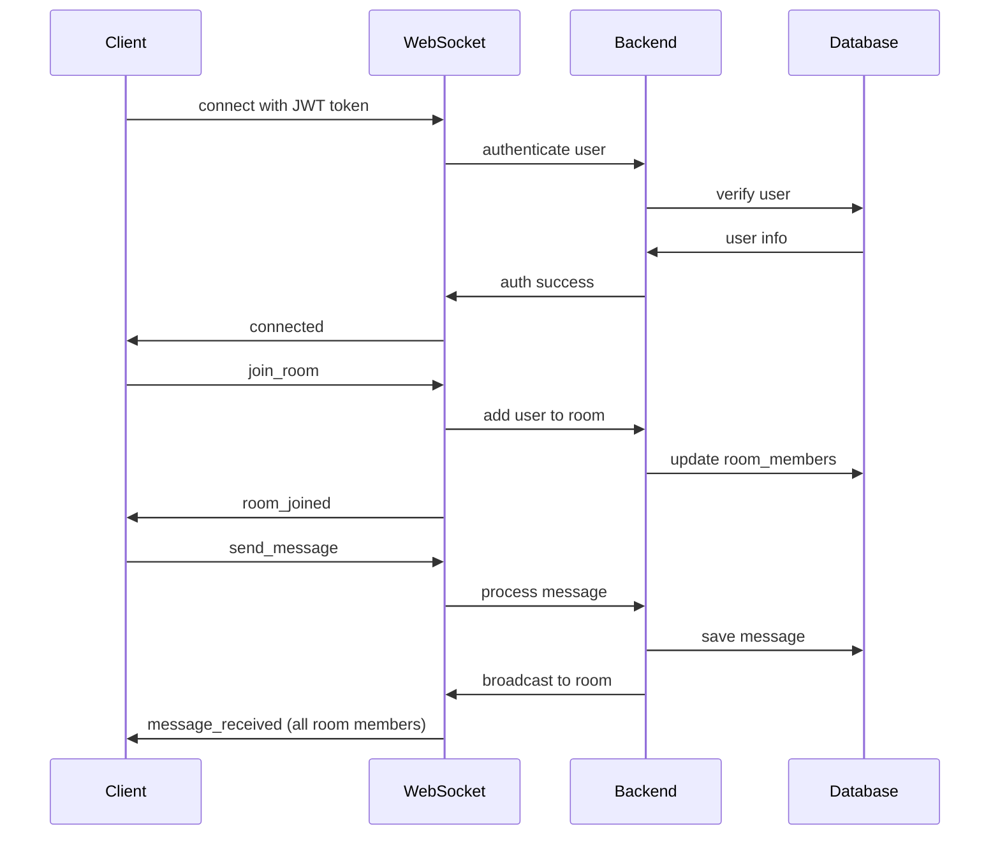

# チャット機能仕様

## 概要

Lunirアプリケーションにリアルタイムチャット機能を実装する。WebSocketを使用してリアルタイム通信を実現。

## 機能要件

### 基本チャット機能
1. **リアルタイムメッセージング**
   - WebSocketによるリアルタイム送受信
   - メッセージの即座表示
   - 接続状態の管理

2. **チャットルーム管理**
   - ルーム作成・参加・退出
   - ルームメンバー管理
   - プライベート・パブリックルーム

3. **メッセージ機能**
   - テキストメッセージ
   - コードブロック（シンタックスハイライト）
   - LaTeX数式（将来実装）
   - 返信機能

## 技術アーキテクチャ

### WebSocket通信フロー



## データ構造

### WebSocketメッセージ形式

```typescript
interface WebSocketMessage {
  type: 'join_room' | 'leave_room' | 'send_message' | 'message_received' | 'user_joined' | 'user_left' | 'error'
  payload: any
  timestamp: string
  message_id?: string
}

// メッセージ送信
interface SendMessagePayload {
  room_id: number
  content: string
  message_type: 'text' | 'code'
  parent_id?: number  // 返信機能用
}

// メッセージ受信
interface MessageReceivedPayload {
  id: number
  content: string
  message_type: 'text' | 'code'
  user: {
    id: number
    username: string
    display_name?: string
    avatar_url?: string
  }
  room_id: number
  parent_id?: number
  created_at: string
}
```

## API エンドポイント

### REST API

| メソッド | エンドポイント | 説明 | 認証 |
|---------|---------------|------|------|
| GET | `/api/v1/rooms` | ルーム一覧取得 | 必要 |
| POST | `/api/v1/rooms` | ルーム作成 | 必要 |
| GET | `/api/v1/rooms/{room_id}` | ルーム詳細取得 | 必要 |
| POST | `/api/v1/rooms/{room_id}/join` | ルーム参加 | 必要 |
| POST | `/api/v1/rooms/{room_id}/leave` | ルーム退出 | 必要 |
| GET | `/api/v1/rooms/{room_id}/messages` | メッセージ履歴取得 | 必要 |

### WebSocket接続

| エンドポイント | 説明 |
|---------------|------|
| `/ws/chat` | チャット用WebSocket接続 |

## 実装手順

### Phase 1: バックエンド実装
1. ✅ WebSocketマネージャー実装
2. ✅ チャットルームCRUD実装  
3. ✅ メッセージ処理実装
4. ✅ リアルタイム通信実装

### Phase 2: フロントエンド実装
1. 🚧 WebSocketクライアント実装
2. 🚧 チャットUI実装
3. 🚧 ルーム管理画面実装
4. 🚧 メッセージ表示・送信実装

### Phase 3: 高度な機能
1. ✅ コードハイライト実装
2. ✅ 返信機能実装
3. ⏸️ オンライン状態表示
4. ⏸️ タイムライン機能（全ルーム横断メッセージ表示）

## UI/UX設計

### チャット画面レイアウト

```
┌─────────────────────────────────────────────┐
│ Header (Lunir + User Info)                  │
├─────────────────────────────────────────────┤
│ ┌─────────────┐ ┌─────────────────────────┐ │
│ │ Room List   │ │ Chat Area               │ │
│ │             │ │ ┌─────────────────────┐ │ │
│ │ • General   │ │ │ Message History     │ │ │
│ │ • Random    │ │ │                     │ │ │
│ │ • Dev       │ │ │ User1: Hello!       │ │ │
│ │             │ │ │ User2: Hi there     │ │ │
│ │ [+ New Room]│ │ │                     │ │ │
│ │             │ │ └─────────────────────┘ │ │
│ │             │ │ ┌─────────────────────┐ │ │
│ │             │ │ │ [Message Input...]  │ │ │
│ │             │ │ │              [Send] │ │ │
│ │             │ │ └─────────────────────┘ │ │
│ └─────────────┘ └─────────────────────────┘ │
└─────────────────────────────────────────────┘
```

## セキュリティ考慮事項

### 1. WebSocket認証
- JWT トークンによる認証
- 接続時の認証検証
- 無効トークンの接続拒否

### 2. 認可制御
- ルーム参加権限チェック
- メッセージ送信権限チェック
- プライベートルームアクセス制御

### 3. 入力検証
- メッセージ内容のサニタイゼーション
- 文字数制限
- レート制限（スパム対策）

## パフォーマンス考慮事項

### 1. スケーラビリティ
- WebSocket接続数管理
- メッセージ配信効率化
- データベースクエリ最適化

### 2. メモリ管理
- 古いメッセージのページネーション
- 接続プールサイズ制限
- メッセージ履歴の効率的読み込み

## テスト戦略

### 1. 単体テスト
- WebSocketマネージャーテスト
- メッセージ処理ロジックテスト
- 認証・認可テスト

### 2. 統合テスト
- WebSocket接続テスト
- エンドツーエンドメッセージングテスト
- ルーム機能テスト

### 3. 負荷テスト
- 同時接続数テスト
- メッセージ配信パフォーマンステスト